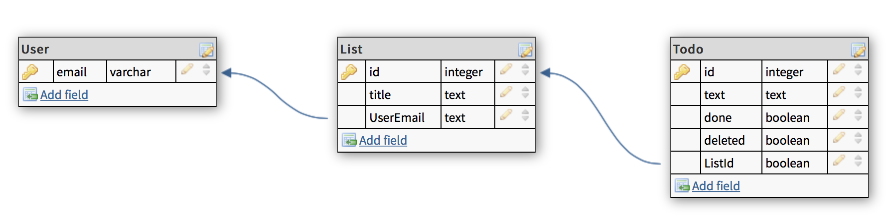

# NODE - from 0 to TODO app

## In this step we will learn

- how to use **sequelize-cli**
- how to **connect** to your **DB**
- how to **create tables and relations** programmatically

### Sequelize

What is **sequelize**?

>Sequelize is a promise-based ORM for Node.js v4 and up. It supports the dialects PostgreSQL, MySQL, SQLite and MSSQL and features solid transaction support, relations, read replication and more.

To make our life easier let's use **sequelize-cli** to generate our DB connection logic.

```sh
npm install --save sequelize pg pg-hstore # we will use PostgreSQL for this tutorial but you can use any from supported one
npm install --save-dev sequelize-cli
```

From that point we can use **sequelize** to generate files for us

```sh
node_modules/.bin/sequelize init
```

Let's take a look at our new files

```sh
├── bin
├── routes
├── public
├── config # new
│   └── config.json
├── models # new
│   └── index.js
├── migrations # new
├── seeders # new
├── README.md
├── package.json
├── .gitignore
└── app.js

```
- `config/config.json` is holding your configurations to connect to DB for different envs
- `models/index.js` is needed to initialize models that will be defined within `models/` folder. It is also exports *db* object to be accessed from other places
- `migrations` will contain migration instructions for transferring our DB from one state to another
- `seeders` will contain data in order to prepopulate our DB.

For now our DB logic is not connected to our server and DB connection is not established. What we have to do right now is change our development config with connection instructions to our DB.

```json
{
  "development": {
    "username": "%your username to DB%",
    "password": "%your password to DB%",
    "database": "%DB name%",
    "host": "127.0.0.1",
    "dialect": "postgres"
  },
 ...
}
```

After that we had to establish connection to DB. And the best place to do that is before starting the server as there will be any issues with DB the server will be useless.
Ok let's add connection logic to our `bin /www` file.

```js
// bin/www

var app = require('../app');
var db = require('../models');
...
/**
 * Listen on provided port, on all network interfaces.
 */

db.sequelize
  .sync()
  .then(() => {
    console.log("Connection has been established successfully.");
    server.listen(port);
    server.on('error', onError);
    server.on('listening', onListening);
  })
  .catch(err => {
    console.error("Unable to connect to the database:", err);
  });
```

Now you can start the server. You should see something like this in your terminal

```sh
...
Connection has been established successfully.
```

For now we don't have any tables created in our DB. Let's try to create the basic data structure for our TODO application.



For ease of use we will do this with **sequelize CLI**.

```sh
node_modules/.bin/sequelize model:generate --name User --attributes email:string
node_modules/.bin/sequelize model:generate --name List --attributes title:string
node_modules/.bin/sequelize model:generate --name Todo --attributes text:string,done:boolean,removed:boolean
```

Alright so now we have our models created in our project but not in the DB. To do that that just run the server. During the connection process sequelize will create those tables for you. If you'll look at your DB you'll notice that there are no connections between those tables. In oder to do that we need to use `associate` method of our **models**. Sequelize uses understandable to people language to [build relations]. Ok let's connect our **Users** to their **Lists**.

```js
// models/user.js
//...
User.associate = function(models) {
  models.User.hasMany(models.List)
};
//...
// models/list.js
//...
List.associate = function(models) {
  models.List.belongsTo(models.User)
};
//...
```

The ORM will do the dirty work for you + will create a methods in those models in order to manipulate related models like `User.findById(1).then(user => user.getLists())` will return all list that have UserId equal 1. Easy as that! for more information you can see [this part of docs]. Go ahead and make association of **List** and **Todo**. Don't forget to restart the server. In order to get our changes to the tables we need to say to **sequelize** to drop tables before initialization:

```js
// bin/www

db.sequelize
  .sync({ force: true }) // <-- add { force: true } as a parameter on sync
```

Congratulations! You have set up the basic DB for your application!

If you ready to go to the next step run:

```sh
git clean -fd
git checkout step-3-DB
```

[build relations]: <http://docs.sequelizejs.com/class/lib/associations/base.js~Association.html>
[this part of docs]: <http://docs.sequelizejs.com/manual/tutorial/associations.html>